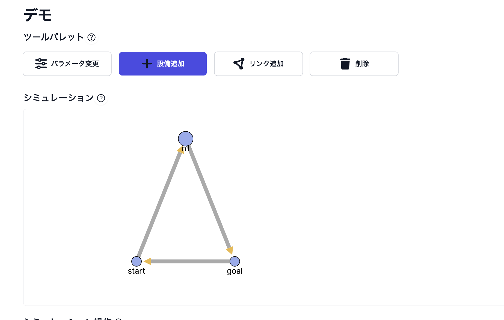
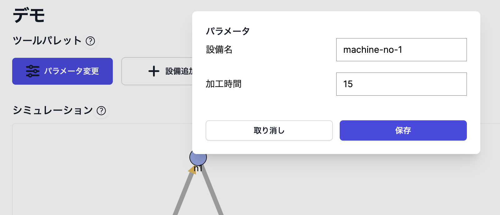
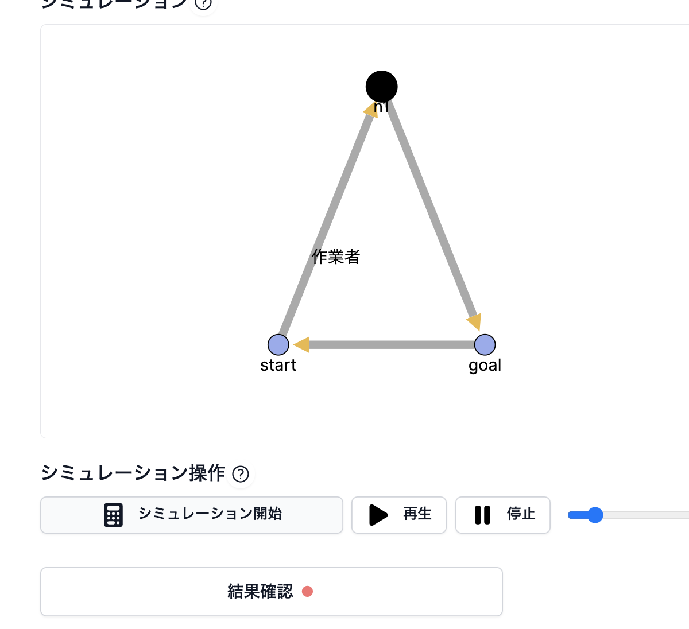
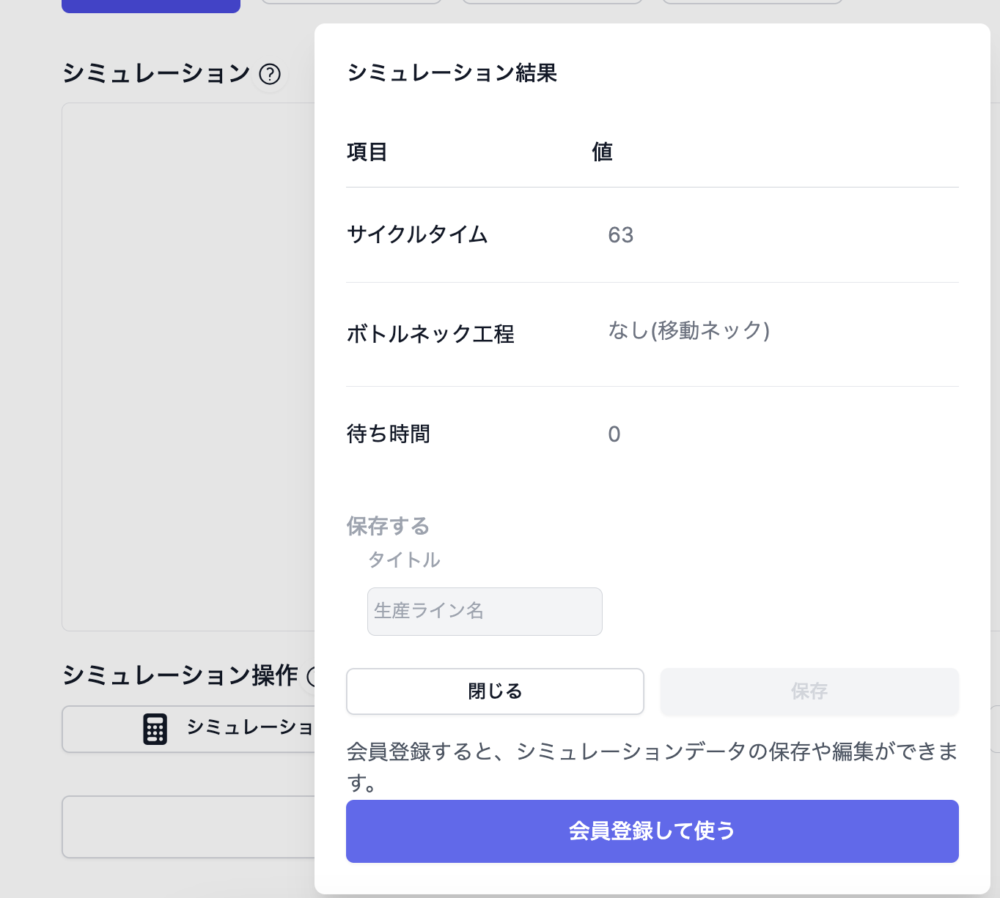

## App URL

### **https://lytcycle-wild-sun-9576.fly.dev/**

## アプリ概要

lytcycle （ライトサイクル）は、製造業向けの簡易な生産ラインシミュレータです

## 課題

- 工場の生産ラインのボトルネックがわからない
- シミュレータを導入したいけど高額
- 表計算ソフトでは生産の流れがわかりづらい

## 解決方法

- ボタンひとつでボトルネックがすぐわかる
- 無料で導入可能
- 直感的な操作で生産の流れを可視化

## 開発の経緯

工場のラインの生産性の向上を検討する際に、どの工程がボトルネックかを知る必要があります。
エクセルを用いようとしても、設備の待ち時間や並列して行われる作業があり、難しいことがありました。

専用のシミュレータは高額。

ならば作ってしまおうと思い、作ることにしました。

## 使用方法

### STEP1: 設備追加・リンク追加



画面に設備を追加し、それぞれをリンクで結びます。

### STEP2: パラメータ変更



設備の加工時間やリンク自体の通過時間を設定します。

### STEP3: シミュレーション開始




あとはシミュレーション開始ボタンを押すだけ。ボトルネック工程がわかります。

## 工夫したところ

- 設備追加やリンク追加をする際に直感的な操作ができるようUIを工夫しました。

## ⚙️ 使用技術

- Ruby 3.2.2
- Ruby on Rails 7.0.8.1
- RSpec
- TailwindCSS
- anime.js
- d3.js

## 💎 主なgem

- devise (ログイン)

# ローカルで起動させる場合

```
$ git clone https://github.com/kyokucho1989/lytcycle.git
$ cd LYTCYCLE
$ bin/setup
$ .bin/dev
```

# Lint/Test

- Lint

```
$ npm run lint
```

- Test

```
$ npm run test
$ bundle exec rspec
```
